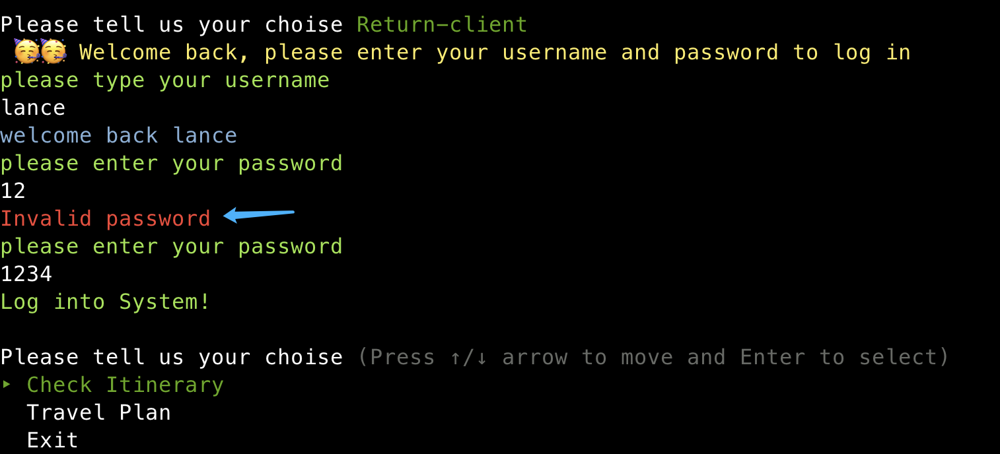

# Ruby Terminal Application :kiss:
## Travel Agent System :bus:
A simple travel order app that can identify client , and them can log in or register, make order, and view order history.


## My source control repository link :octocat:
<a href="https://github.com/lanceliumeng/Terminal_Application" target="blank">Ruby Terminal Application</a>

## Software Development Plan :pushpin:

1. ### The application purpose and scope :mag:
- The app can make a simple order system for travel agents. It can allow users to log in, check itinerary details, and order. The app will display the order details and total price when they complete the order.
  
- I have worked in Tasmania travel company for last three years. My previous boss told me he wants a system to display our itinerary for clients. He also wants the system to record each order and show order details to the client. But I didn't know IT knowledge, so we had to record every order in an Excel file, but when we faced many orders, recording all of them was not the best idea for operators, this process could waste their working time. That's why I have this idea and built this simple application.
  
- Target audience: Travel agency who want to save operator working time and automatically display itinerary to the client, then help them place an order faster.
  
- How to use the app: First of all, each user needs to register if you are a new client, then input your username and password to check options. There are only two main options at this stage: check itinerary details, according to the info to input itinerary name and quantity. When you finish, type "done" into the terminal, and then the app will base on your input to display your order details, including itinerary name and total payment.

2. ### A list of features :books:
- Users identify
   - At this stage, I create ExistUsers class in the class file and register method in the methods file. In the ExistUsers class file, I use the class variable @@users_details to make a fake database,so I can use it in each class method (In this case, I use it in username_check class method). When clients choose return-client, they need to input their username and password. If the username input cannot match the name in @@users_details, the app will display "please register first".If the user types the wrong password, an error will raise and display "Invalid password" to the client. When username and password match @@users_details, login successfully and go into the next step.     
   - If users choose new-client, then they need to input a valid username and password. If they try to input empty, then app will raise another error and notify them with the message "username cannot be empty or including blank space, please try again." When input finish, the app will display username and password to clients.

- When users login successfully, then can choose check the itinerary details, I create a methond: brochure, it allows to open a text file and display it to users. 
  
- Users can make their orders according to itineraries. Just type item name and quantity. When they type done, and the order is confirmed. The app can show the order details and total price to users.If users try to put invalid item name, they only can get nothing in their order details and $0 in total price.  
  
- The main ruby file is very DRY,it only include basic logic for choice. I put all complex codes in method and class files.
  
- Add ruby gems to my code. Such as 'colorize', it can let some output message outstanding.'tty-prompt' creates a list for the user to choose each item.'tty-spinner' and 'tty-progressbar' can display a progress bar in users command line. Have fun 😁

3. ### Outline of the user interaction and experience for the application. :telescope:
- For User identify feature:
Users need to choose an option in list,if they choose 'Return-client', they need to input username and password. For now, the database only preset the below username and password:"lance" => 1234, "sara" => 5678, "thomas" => 6356


  - if the input username is not in database, then exit the app.
  
   
  - if input username is correct but password is wrong, the app will raise an error and notice the client, and they need to type again until password is correct.
   

- If clients choose a new-client option, they need to input a username and password for registration purposes. They can not type blank space for username or password otherwise, an error will raise. When the user successfully registers, then the processing bar will output. The app also displays username and password for client record.


- After users log in, they will have three options: Check itinerary, Travel plan and Exit. The green color is active when a specific choice is selected.

  - choose check itinerary, the app will open brochure file and display itineray details for client. The options won't disapper so that client can place order.
  
  - choose travel plan, user can input itinerary name and quantity to place an order, they can type done to complete order. If user type invalid itinerary name, it won't influnce the order display.
   
  - choose exit, display goodbye notes.
   

4. ### Control flow diagram of the app :scroll:


5. ### Implementation plan, Draft Draw and Trello
- <a href="https://trello.com/b/Xb3Nh02i/t1a3-terminal-application" target="blank">My Trello Link</a>
- Day 1, I draw a draft work flow for the application and add brainstrom list in my trello,each card has deadline dates. 


- Day 2 to Day 7, base on Trello cards, I created check list for each of them. When I complete check list, move it to DONE part. 


## Help documentation :clap::clap::clap:

### Steps to install the app
- You need to install Ruby 3.0.2 in your local system. <a href="https://www.ruby-lang.org/en/downloads/" target="blank">Click here for more Ruby info</a>
  
- For run the application successfully, you also need to install gem bundler,it is gem dependency manager which can allow you use ruby gems. <a href="https://bundler.io/" target="blank">Click here for more Bundler info</a>
  
- You can install it with the following command:
```console
gem install bundler
```
- You also need to install requirment ruby gems(dependencies) to make sure you won't miss any features in the application. You can check dependencise details in Gemfile.
  
- Please make sure install gems in src folder directory. You can install gems with the command:
```console
bundle install
```

- When you complete the above steps, you can run the app by command:
```console
ruby main.rb
```

- Or in src folder directory, run command:
```console
./script-sh/app-runner.sh
```

- The app passed Rspec test, you can find test details in test-log folder.

- You can use -flag in command line for more information.
```console
ruby main.rb -help
=> You can use flag -info to get ruby versions and gems details
For more infomation,please find README file

ruby main.rb -info
=> This terminal application needs ruby 3.0.2
This app also need rubu gems : colorize, tty-color, tty-prompt, tty-spinner and tty-progressbar

ruby main.rb -sdsfhh
=> I can not find this argument, please find more information in README file
```
